# FraudOps — End-to-End Demo Script

A 6-minute walkthrough of the entire system. Follow this as a **live
demo**, or read it as a **replay of what you see in the screenshots
below**. Every screen was captured against the running application.

**Time budget:** 6 minutes. **Screens:** 12. **What you'll cover:**
auth + RBAC → live streaming → ML scoring → alerts → architecture →
API surface → design decisions.

---

## Setup (before the demo)

1. Backend up on `:8001`, frontend on `:3000`, Mongo reachable.
2. **Clean slate is fine** — the alerts panel will populate as soon as
   you start the simulator. If you want history in view immediately,
   click *Inject Fraud* twice before the audience joins.
3. Have the *Technical Deep Dive* open in a second tab in case anyone
   asks "how does that work?".

---

## Storyboard

Each row is a screen (with the file name of the captured screenshot) and
the exact narration to deliver.

### 1. The login screen — RBAC by first impression
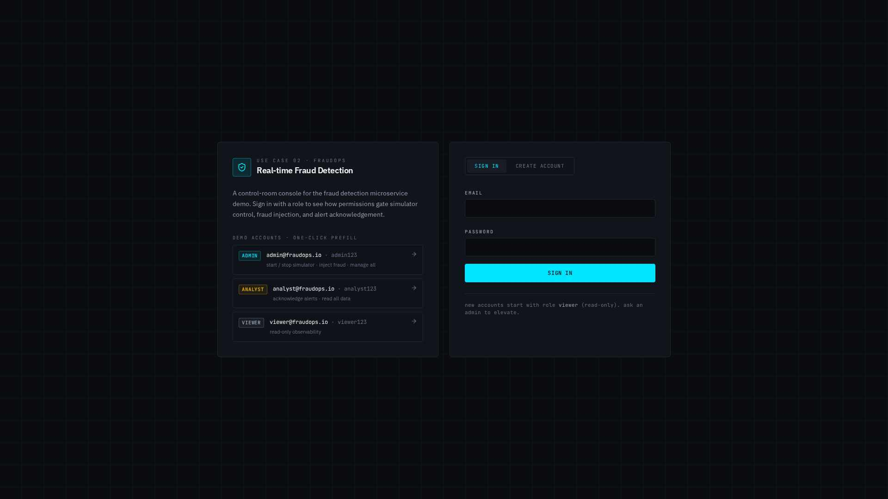

> "This is a real-time fraud detection console. Before we do anything
> else — notice the three demo accounts on the left. Admin can control
> the simulator. Analyst can acknowledge alerts. Viewer is read-only.
> Same JWT auth flow, three different capability sets. Let's start as
> admin."

**Action:** click **ADMIN** on the left card.

---

### 2. One-click prefill
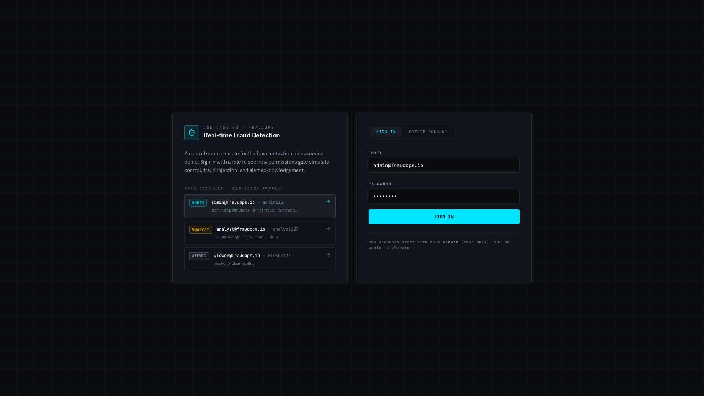

> "The demo-account chip prefills the email and password. In a real
> deployment you'd type these — here it just saves you time."

**Action:** click **SIGN IN**.

---

### 3. Idle dashboard — the observability skeleton
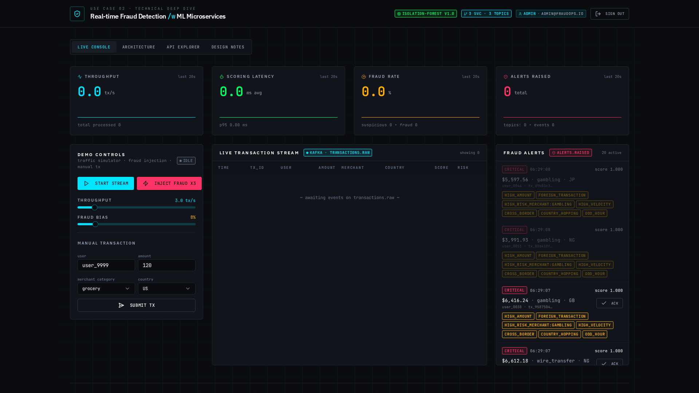

> "This is what an operator sees on a quiet morning. Four KPIs across
> the top — throughput, scoring latency, fraud rate, alerts raised. On
> the left, demo controls. In the middle, the live transaction stream —
> currently empty. On the right, the fraud alerts panel — you can see
> alerts from yesterday's runs, restored from Mongo on cold start.
> That's the *rehydration* piece I want to point out: the ring buffer
> is warm before we touch anything."

**Action:** none yet — talk over the layout.

---

### 4. Start the stream — Kafka comes alive
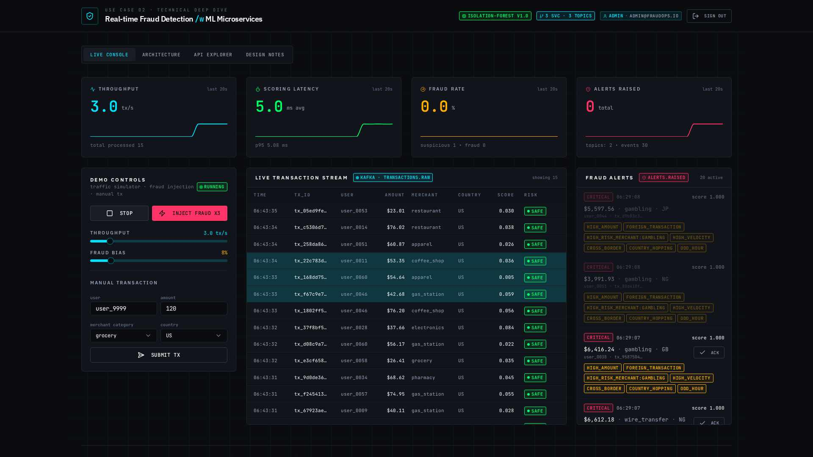

> "I'll turn the simulator on at ~3 transactions per second. Watch what
> happens: the throughput KPI comes to life; the latency KPI hovers
> around 5 ms because IsolationForest inference is fast; the live
> stream fills up with rows tagged SAFE or REVIEW. The chip in the
> stream header says `KAFKA · transactions.raw` — that's the topic
> these events are flowing through."

**Action:** click **START STREAM**. Wait 5 seconds.

**Key points to mention:**
- KPIs update once per second (polling `/api/metrics`).
- The score column shows the fused ML+rules score.
- SAFE / REVIEW / BLOCK map to the decision thresholds 0.50 / 0.75.

---

### 5. Inject fraud — the alert flow
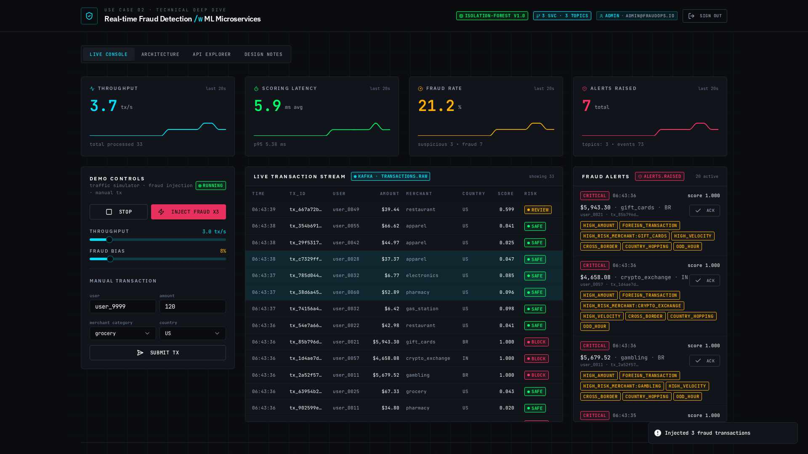

> "Now the interesting part. I'm going to inject a burst of fraudy
> transactions — crypto exchanges, wire transfers, foreign countries,
> high velocity. Watch the alerts panel."

**Action:** click **INJECT FRAUD x3** twice.

> "See? Every high-risk transaction hits the *fraud.scores* topic,
> the alert service picks up anything with `risk_level == fraud`,
> and raises a critical alert with **reason codes** — high_amount,
> foreign_transaction, high_risk_merchant, cross_border, and so on.
> That's the fusion score doing its job: the ML model catches the
> anomaly and the rule engine tells you *why*."

**Talking points:**
- Reason codes are what the compliance team gets in the audit trail.
- Fraud rate KPI on the top now shows the injection burst.
- Every alert has a severity chip and an ACK button (I'll ack one
  later as an analyst).

---

### 6. The Architecture tab — the money slide
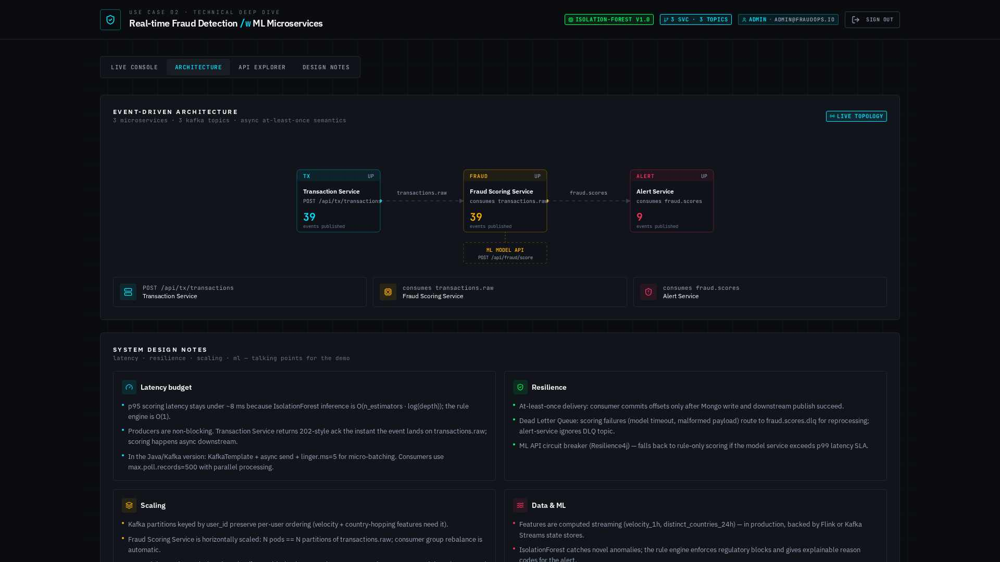

> "This is the system diagram. Three microservices — Transaction,
> Fraud Scoring, Alert. Three Kafka topics. One ML API. The particles
> flowing along the arrows are live event counts — the numbers you
> see are actual publishes since this process booted. If I stopped the
> simulator right now they'd stop moving."

**Action:** click **ARCHITECTURE** tab.

**Deep-dive if asked:**
- Why one bus / three topics? Kafka semantics — per-topic ordering,
  independent throughput, independent restarts.
- ML API dashed line — the model lives in its own service so we can
  canary versions independently. The scoring service is just a client
  of that API.

---

### 7. The API Explorer — endpoint contracts
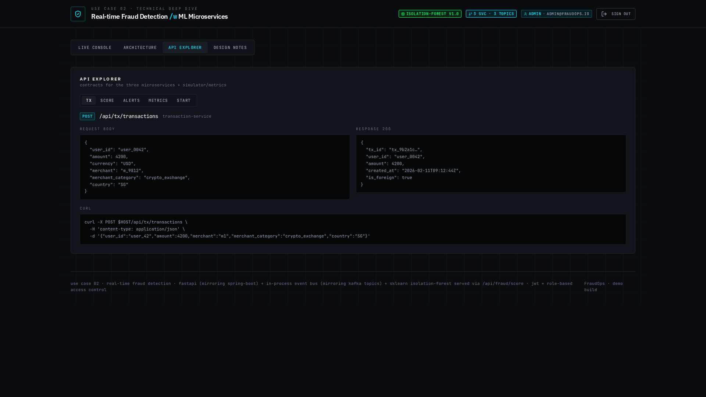

> "For anyone doing integration — every endpoint has a request /
> response contract with a curl one-liner. Here's the transaction
> ingest — a merchant SDK would POST this shape."

**Action:** click **API EXPLORER** tab. The `tx` sub-tab is open by
default.

---

### 8. The ML API contract
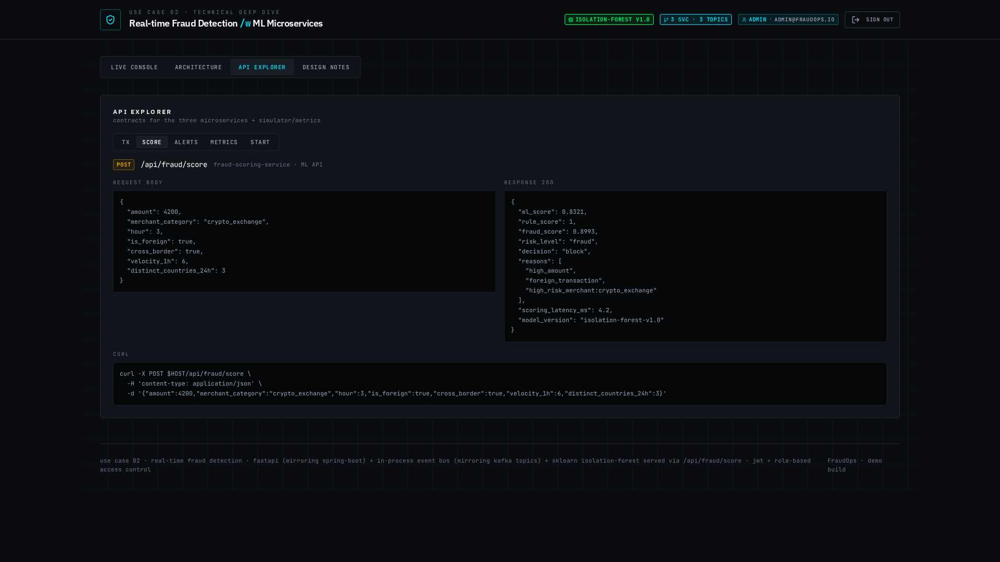

> "And here's the ML API itself. It's not hidden behind the scoring
> service — you can call `POST /api/fraud/score` directly, which is how
> our model-monitoring pipeline back-tests new versions. Notice
> `model_version` in the response — every scored event is tagged so we
> can slice metrics by model."

**Action:** click the **score** sub-tab.

---

### 9. Design Notes — the story we tell in interviews
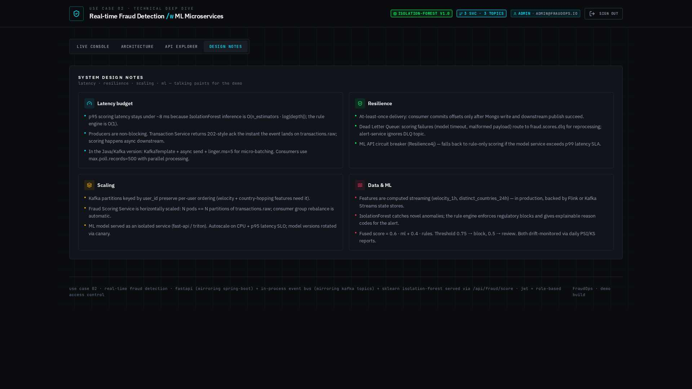

> "Four pillars — latency, resilience, scaling, data & ML. These are
> the talking points if anyone asks 'what happens if the model service
> is slow?' or 'how do you handle poisoned messages?'."

**Action:** click **DESIGN NOTES** tab (or scroll down on the
Architecture tab where they also appear).

**Cover in ~30s:**
- Latency: p95 < 8 ms, non-blocking producers, async consumers.
- Resilience: DLQ + circuit breaker fallback to rule-only scoring.
- Scaling: partition by `user_id`, N pods == N partitions.
- ML: fused score, drift monitoring via PSI/KS.

---

### 10. Sign in as viewer — RBAC in action


> "Now the RBAC story. I sign out and back in as a viewer. Same
> dashboard, same live data — but notice: START STREAM and INJECT
> FRAUD are greyed out. There's a yellow notice telling me why.
> Sliders disabled. Even the alerts panel on the right — no ACK
> buttons. That's role-based access enforced both at the API layer
> **and** in the UI, so what I can see matches what I can do."

**Action:** click **SIGN OUT** → **VIEWER** card → **SIGN IN**.

**Talking points:**
- The affordance stays visible — the user knows what they'd unlock
  as an admin/analyst.
- Backend returns 403 to any protected endpoint even if the UI is
  bypassed — belt and braces.

---

### 11. Sign in as analyst — the ack workflow
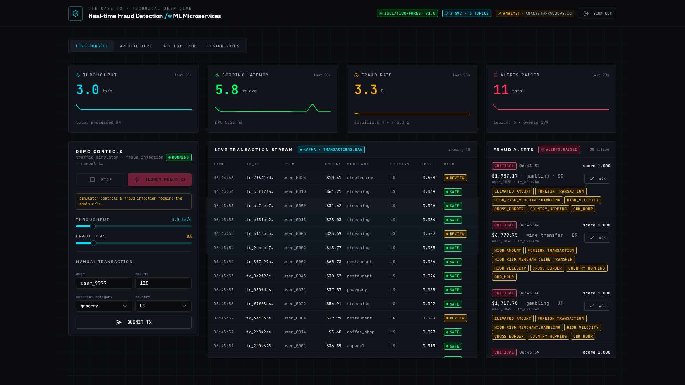

> "Analyst is the middle role. Can't start the stream, but *can*
> triage alerts. Look at the alerts panel — the ACK buttons are back."

**Action:** click **SIGN OUT** → **ANALYST** card → **SIGN IN**.

---

### 12. Acknowledging an alert
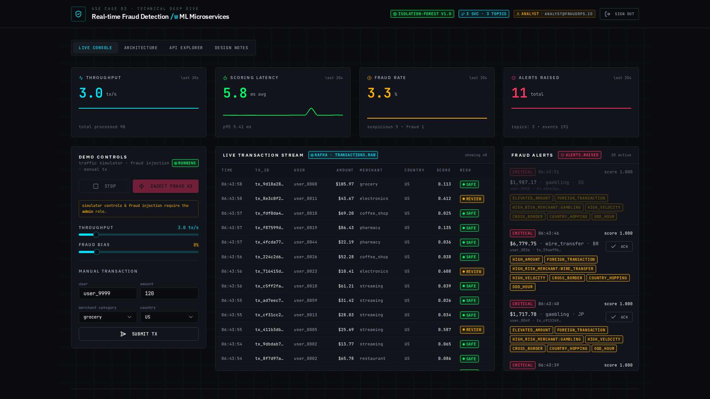

> "I ack the top alert — it fades to acknowledged state, backend
> persists it in Mongo (`db.alerts.update_one`). If the same alert
> comes back in a re-hydration, it'll still be marked acknowledged.
> And if I try to ack an alert that doesn't exist, the API returns
> 404 — clean semantics, easy to monitor."

**Action:** click **ACK** on the top alert card.

**Wrap-up sentence:**

> "That's the tour. Three microservices, one event bus, one ML API,
> full auth + RBAC, live observability, and a design story that
> maps 1-to-1 onto Spring Boot + Kafka when you're ready to ship."

---

## Backup material (if the audience wants more)

### Quick backend sanity checks (from a terminal)

```bash
export API=$REACT_APP_BACKEND_URL

# 1. Anon endpoints work
curl -s $API/api/          | jq
curl -s $API/api/health    | jq

# 2. Anon fails on protected routes
curl -s -o /dev/null -w '%{http_code}\n' $API/api/metrics  # → 401

# 3. Log in as admin
TOKEN=$(curl -s -X POST $API/api/auth/login \
  -H 'content-type: application/json' \
  -d '{"email":"admin@fraudops.io","password":"admin123"}' \
  | jq -r .access_token)

# 4. Score a fraudy transaction directly against the ML API
curl -s -X POST $API/api/fraud/score \
  -H "authorization: Bearer $TOKEN" \
  -H 'content-type: application/json' \
  -d '{"amount":6400,"merchant_category":"crypto_exchange","hour":3,
       "is_foreign":true,"cross_border":true,"velocity_1h":8,
       "distinct_countries_24h":4}' | jq

# 5. Kick the simulator
curl -s -X POST $API/api/simulator/start \
  -H "authorization: Bearer $TOKEN" \
  -H 'content-type: application/json' \
  -d '{"tps":5,"fraud_bias":0.2}' | jq

# 6. Force a burst of frauds
curl -s -X POST "$API/api/simulator/inject-fraud?count=5" \
  -H "authorization: Bearer $TOKEN" | jq

# 7. Read the KPI snapshot
curl -s $API/api/metrics -H "authorization: Bearer $TOKEN" | jq

# 8. Stop
curl -s -X POST $API/api/simulator/stop -H "authorization: Bearer $TOKEN" | jq
```

### Objections / hard questions you may hear

**Q: Why FastAPI in a demo for a Java assignment?**
> To keep the setup portable — the design is what's being tested, and
> the mapping to Spring Boot + Kafka is 1-to-1 (see section 16 of the
> deep dive). Every FastAPI dependency has a Spring counterpart.

**Q: Can this handle 5k rps?**
> Not this single-process demo — but the architecture does. Transaction
> service is stateless behind an ALB, scoring service is horizontally
> scaled on Kafka partitions keyed by user_id, alert service scales on
> topic lag. See section 15 for the sizing story.

**Q: What if the ML model goes down?**
> Circuit breaker fallback to rule-only scoring. We'd rather approve on
> rules alone than freeze the stream. Section 14.

**Q: Why bcrypt and not Argon2?**
> Either is fine. Bcrypt cost 12 is standard in Java (BCryptPasswordEncoder)
> and Python, so passwords hashed here are portable if we ever migrate.
> Argon2 is preferred for greenfield systems; bcrypt still matches
> current OWASP recommendations for cost > 10.

**Q: What about model drift?**
> `model_version` is stamped on every scored event. Nightly job compares
> today's `ml_score` distribution to a rolling 7-day baseline via PSI
> (Population Stability Index) and KS test. Drift > 0.2 pages the
> on-call ML engineer.

---

## Recording a video from this script

If you want to produce an actual MP4:

1. **Frame rate**: 30 fps is plenty. This is not gaming footage.
2. **Length**: aim for 5–6 minutes. Trim aggressively.
3. **Cursor**: use a cursor-highlight tool (macOS: `Present.mac`,
   OBS: `Cursor Emphasize` filter). It reads much better on video than
   raw mouse motion.
4. **Voice-over**: record separately if you can, then re-align. Live
   narration under stress usually needs three takes.
5. **Music**: keep it under -30 dBFS. This is a demo, not a trailer.
6. **Export**: 1080p × 30fps H.264 at ~4 Mbps. Ends up around 150 MB
   for six minutes.
7. **Cut points** the script implies:
   - After screen 3 (idle dashboard) → 1 s pause
   - After screen 5 (fraud injected) → 2 s pause on the alerts
   - After screen 12 (ack) → title card + logo

That's the demo. Everything the audience needs, in the order they
need it.
