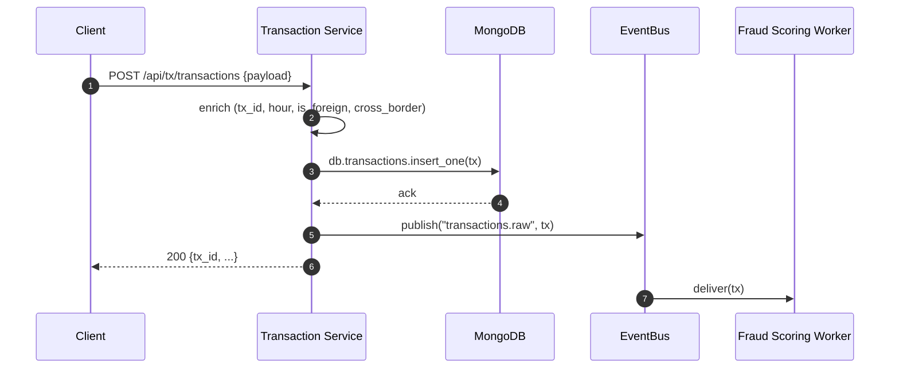
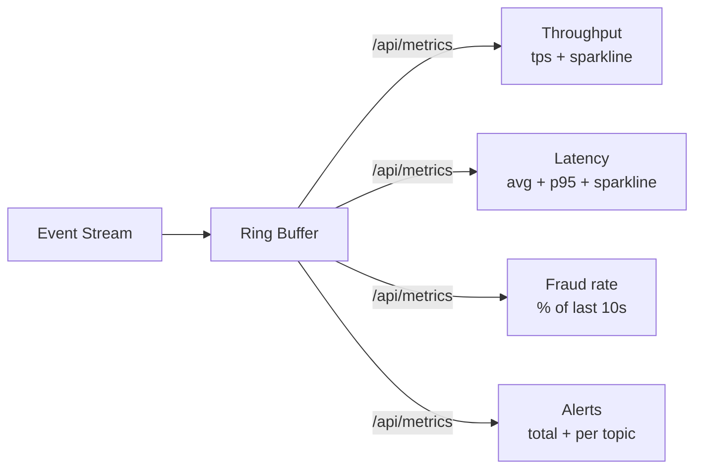

# FraudOps — Technical Deep Dive

> Real-time fraud detection microservices with ML integration.
> Every subsystem, every dependency, every line of glue — explained.

**Reading time:** 20–25 minutes.
**Audience:** senior engineers, tech-lead interviewers, ML engineers, buyers.

---

## Table of contents

1. [Business problem](#1-business-problem)
2. [System-of-systems architecture](#2-system-of-systems-architecture)
3. [Event bus — the Kafka simulator](#3-event-bus--the-kafka-simulator)
4. [The Transaction Service](#4-the-transaction-service)
5. [The Fraud Scoring Service](#5-the-fraud-scoring-service)
6. [The Alert Service](#6-the-alert-service)
7. [The ML model API](#7-the-ml-model-api)
8. [Traffic simulator](#8-traffic-simulator)
9. [Metrics & observability](#9-metrics--observability)
10. [Authentication & RBAC](#10-authentication--rbac)
11. [Persistence layer](#11-persistence-layer)
12. [Frontend architecture](#12-frontend-architecture)
13. [Latency budget](#13-latency-budget)
14. [Resilience](#14-resilience)
15. [Horizontal scaling](#15-horizontal-scaling)
16. [Local ↔ production mapping (Spring Boot + Kafka)](#16-local--production-mapping-spring-boot--kafka)
17. [Testing strategy](#17-testing-strategy)
18. [Threat model & security notes](#18-threat-model--security-notes)

---

## 1. Business problem

A payment processor sees ~5,000 card authorisations per second at peak.
It needs to score each transaction in **single-digit milliseconds**, decide
`approve | review | block`, and raise an **alert** for anything the model
flags as fraud, all without stopping the money-moving hot path.

### Non-functional requirements

| Requirement | Target |
| --- | --- |
| Scoring p95 latency | ≤ 10 ms |
| End-to-end approve latency | ≤ 50 ms |
| Availability | 99.95% (≈ 4h/year downtime) |
| Model retraining cadence | Weekly, canary rollout |
| Fraud recall (block + review) | ≥ 92% |
| Explainability | Every alert carries reason codes |

### Functional requirements

- Ingest transactions via HTTP.
- Score every transaction with an **ML model that is itself a service**
  (so the model can be versioned, scaled and canaried independently).
- Publish scored events to a stream.
- Raise alerts on high-risk events, allow analysts to acknowledge them.
- Provide observability (throughput, latency, fraud rate) and a manual
  test surface (single-tx submit, fraud injection).
- Authenticate operators; only some roles may change the running system.

---

## 2. System-of-systems architecture

Three logical microservices communicate exclusively through an **event
bus** — never by direct HTTP calls between each other. This is the key
architectural property that keeps them decoupled, scalable and testable.

```mermaid
flowchart LR
    subgraph Clients
      OPS[Ops Console\nReact SPA]
      SDK[Merchant SDKs]
    end

    subgraph Auth[Auth]
      A0[/api/auth/*]
    end

    subgraph Bus[Event Bus - Kafka-style topics]
      T1((transactions.raw))
      T2((fraud.scores))
      T3((alerts.raised))
    end

    subgraph TX[Transaction Service]
      TXH[POST /api/tx/transactions]
      TXR[GET /api/tx/transactions/recent]
    end

    subgraph FS[Fraud Scoring Service]
      FSH[POST /api/fraud/score - ML API]
      FSR[GET /api/fraud/scores/recent]
      FSW[Consumer worker]
    end

    subgraph AL[Alert Service]
      ALR[GET /api/alerts/recent]
      ALA[POST /api/alerts/:id/ack]
      ALW[Consumer worker]
    end

    subgraph OBS[Observability]
      MT[GET /api/metrics]
      SIM[/api/simulator/*]
    end

    SDK -->|https| TXH
    OPS -->|https + JWT| A0
    OPS -->|https + JWT| TXR
    OPS -->|https + JWT| FSR
    OPS -->|https + JWT| ALR
    OPS -->|https + JWT| MT
    OPS -->|https + JWT| SIM

    TXH -->|produce| T1
    T1 -->|consume| FSW
    FSW -->|produce| T2
    T2 -->|consume| ALW
    ALW -->|produce| T3

    FSW -->|calls locally| FSH
```

Two production truths this diagram encodes:

1. **The ML model is a service, not a library.** `POST /api/fraud/score`
   is the interface the scoring worker uses. In production this is a
   separate deployment (TorchServe / Triton / a FastAPI pod) so the model
   can be rolled forward without redeploying the scoring service, and the
   *rest* of the system can canary against multiple model versions.
2. **Alerts are their own service.** They own their storage, ack state,
   and severity policy. If we want to add PagerDuty, Slack, Splunk,
   they hook here.

---

## 3. Event bus — the Kafka simulator

**File:** `backend/services/event_bus.py`

We didn't want the demo to require running Kafka locally, so we wrote a
tiny bus that has the **same semantics** we'd rely on with `spring-kafka`:

- Topics are strings; producers `publish(topic, event)`.
- Consumers `subscribe(topic, handler)` and receive events **in order**,
  one handler invocation per event.
- At-least-once semantics: handler failures are logged, not swallowed
  silently. (In Kafka this would be `enable.auto.commit=false` +
  `commitSync()` only on success.)

```python
# backend/services/event_bus.py
class EventBus:
    def __init__(self):
        self._subscribers = defaultdict(list)          # topic -> [handler...]
        self._queues      = defaultdict(asyncio.Queue) # topic -> queue
        self._workers     = []
        self.published_count = defaultdict(int)

    def subscribe(self, topic, handler):
        self._subscribers[topic].append(handler)

    async def publish(self, topic, event):
        self.published_count[topic] += 1
        await self._queues[topic].put(event)

    async def _consume_topic(self, topic):
        while True:
            event = await self._queues[topic].get()
            for handler in self._subscribers[topic]:
                try:
                    await handler(event)
                except Exception:
                    logger.exception("handler failed for topic %s", topic)

    def start(self):
        # One worker task per topic — mirrors "one consumer per topic".
        for topic in list(self._subscribers.keys()):
            self._workers.append(asyncio.create_task(self._consume_topic(topic)))
```

**Topics** (constants at bottom of the file):

```python
TOPIC_TX_RAW       = "transactions.raw"
TOPIC_FRAUD_SCORES = "fraud.scores"
TOPIC_ALERTS       = "alerts.raised"
```

The bus is a module-level singleton (`bus = EventBus()`). Subscribers
register at *import time* — see how `fraud_scoring_service.py` and
`alert_service.py` end with:

```python
bus.subscribe(TOPIC_TX_RAW, _on_transaction)
```

so that by the time `bus.start()` runs during app startup, all wiring
is in place.

### Why one queue per topic and not one big queue?

- **Ordering** is per-topic in Kafka. Per-topic queues preserve that.
- **Independent throughput** — a slow alert consumer can't back-pressure
  the transaction stream.
- **Independent restarts** — cancel/restart one worker without
  interrupting the others.

### Migrating to real Kafka

Replace `bus.publish(...)` with `KafkaTemplate.send(topic, key, value)`
and `bus.subscribe(...)` with `@KafkaListener(topics=…, groupId=…)`.
Everything else — payload shapes, ordering assumption, at-least-once
semantics — is identical.

---

## 4. The Transaction Service

**File:** `backend/services/transaction_service.py`
**Base path:** `/api/tx`

Owns *transaction ingestion*. Its only job is to accept a valid
transaction, persist it, and publish to `transactions.raw`. It never
scores, never alerts.

```python
class TransactionIn(BaseModel):
    user_id: str
    amount: float = Field(..., gt=0)
    currency: str = "USD"
    merchant: str
    merchant_category: str
    country: str = "US"
    hour: Optional[int] = None
    velocity_1h: float = 0
    distinct_countries_24h: int = 1
    is_foreign: Optional[bool] = None
    cross_border: Optional[bool] = None


async def publish_transaction(tx):
    tx.setdefault("tx_id", f"tx_{uuid.uuid4().hex[:12]}")
    tx.setdefault("created_at", datetime.now(timezone.utc).isoformat())
    if tx.get("hour") is None:
        tx["hour"] = datetime.now(timezone.utc).hour
    if tx.get("is_foreign") is None:
        tx["is_foreign"] = tx.get("country", "US") != "US"
    if tx.get("cross_border") is None:
        tx["cross_border"] = tx["is_foreign"]

    transactions_store.add(tx)
    await _db.transactions.insert_one({**tx})
    await bus.publish(TOPIC_TX_RAW, tx)
    return tx
```

Key design choices:

- **The write to Mongo comes *before* the publish.** If Mongo fails, the
  event is not published. This preserves *no-alert-without-a-transaction*
  invariant.
- **Enrichment is idempotent.** Fields the caller didn't supply are
  filled in, but never overwritten. This is the classic "producer
  enrichment" step you'd do in a Kafka Streams topology.
- **The endpoint requires an authenticated user** (any role):

  ```python
  @router.post("/transactions")
  async def create_transaction(payload: TransactionIn, _user=Depends(get_current_user)):
      return await publish_transaction(payload.model_dump())
  ```

### Sequence: happy-path publish



---

## 5. The Fraud Scoring Service

**File:** `backend/services/fraud_scoring_service.py`
**Base path:** `/api/fraud`

Consumes `transactions.raw`, invokes the ML model, publishes `fraud.scores`.

Two surface areas:

1. **Consumer** — the async handler `_on_transaction` registered against
   the bus. Runs on the event-bus worker task, one tx at a time.
2. **HTTP-visible ML API** — `POST /api/fraud/score`. Analysts, model
   monitoring tools, and back-testing pipelines call this directly. It
   returns exactly the same shape the consumer produces.

```python
async def _on_transaction(tx):
    result = model.score(tx)
    event = {
        "tx_id": tx["tx_id"],
        "user_id": tx["user_id"],
        "amount": tx["amount"],
        "merchant_category": tx["merchant_category"],
        "country": tx.get("country"),
        "scored_at": datetime.now(timezone.utc).isoformat(),
        **result,
    }
    scores_store.add(event)
    await _db.fraud_scores.insert_one({**event})
    metrics.record(
        latency_ms=result["scoring_latency_ms"],
        risk_level=result["risk_level"],
        is_alert=result["risk_level"] == "fraud",
    )
    await bus.publish(TOPIC_FRAUD_SCORES, event)

bus.subscribe(TOPIC_TX_RAW, _on_transaction)
```

Notable:

- **Metrics are recorded here, not in the model.** The model returns
  its own `scoring_latency_ms` (pure inference time). The service adds
  overall throughput and fraud-rate rollup — that's an observability
  concern, not an ML concern.
- **The Mongo write and the bus publish are both awaited.** In real
  Kafka you would `commitSync()` after both — see [Resilience](#14-resilience)
  for the DLQ story.

---

## 6. The Alert Service

**File:** `backend/services/alert_service.py`
**Base path:** `/api/alerts`

Consumes `fraud.scores`. If `risk_level == "fraud"`, it raises an alert.

```python
def _severity(score):
    if score >= 0.90: return "critical"
    if score >= 0.75: return "high"
    return "medium"

async def _on_score(evt):
    if evt["risk_level"] != "fraud":
        return
    alert = {
        "alert_id": f"al_{uuid.uuid4().hex[:12]}",
        "tx_id": evt["tx_id"], "user_id": evt["user_id"],
        "amount": evt["amount"], "merchant_category": evt["merchant_category"],
        "country": evt.get("country"),
        "fraud_score": evt["fraud_score"],
        "severity": _severity(evt["fraud_score"]),
        "reasons": evt["reasons"], "decision": evt["decision"],
        "raised_at": datetime.now(timezone.utc).isoformat(),
        "acknowledged": False,
    }
    alerts_store.add(alert)
    await _db.alerts.insert_one({**alert})
    await bus.publish(TOPIC_ALERTS, alert)

bus.subscribe(TOPIC_FRAUD_SCORES, _on_score)
```

### Ack endpoint — real 404 semantics

```python
@router.post("/{alert_id}/ack")
async def acknowledge(alert_id, _user=Depends(require_role(ROLE_ADMIN, ROLE_ANALYST))):
    for item in alerts_store.all():
        if item["alert_id"] == alert_id:
            item["acknowledged"] = True
            await _db.alerts.update_one({"alert_id": alert_id}, {"$set": {"acknowledged": True}})
            return {"ok": True, "alert_id": alert_id}

    # Fallback: not in memory but may be in Mongo (older alert)
    result = await _db.alerts.update_one({"alert_id": alert_id}, {"$set": {"acknowledged": True}})
    if result.matched_count == 0:
        raise HTTPException(status_code=404, detail=f"Alert {alert_id} not found")
    return {"ok": True, "alert_id": alert_id}
```

The RBAC guard `require_role(ROLE_ADMIN, ROLE_ANALYST)` is the *only*
line stopping a `viewer` from acknowledging an alert. This is
intentionally trivial to audit.

### Cold-start rehydration

```python
async def rehydrate_alerts_store(limit=200):
    cursor = _db.alerts.find({}, {"_id": 0}).sort("raised_at", -1).limit(limit)
    docs = await cursor.to_list(length=limit)
    docs.reverse()
    for doc in docs:
        alerts_store.add(doc)
    return len(docs)
```

Called from the lifespan hook in `server.py`. Without this, an operator
signing in right after a redeploy would see an empty alerts panel even
though there are open cases in the database. Same story you'd solve in
Java by seeding an `@EventListener(ApplicationReadyEvent)` bean from a
Mongo `find`.

---

## 7. The ML model API

**File:** `backend/services/ml_model.py`
**Endpoint:** `POST /api/fraud/score`

The model is a **fusion of two components**:

1. **IsolationForest** (unsupervised) — trained on 5,000 synthetic
   "normal" transactions with 7 features:

   | Feature | Meaning |
   | --- | --- |
   | `amount` | Transaction amount in USD |
   | `hour` | Local hour (0–23) |
   | `is_foreign` | 1 if country ≠ home country |
   | `is_high_risk_merchant` | 1 if merchant_category ∈ {crypto_exchange, gift_cards, wire_transfer, gambling} |
   | `velocity_1h` | Number of tx from this user in last hour |
   | `cross_border` | 1 if country ≠ user's home country |
   | `distinct_countries_24h` | Number of distinct countries this user transacted from in the last 24h |

   IsolationForest's raw anomaly score is normalized to `[0, 1]` using
   the training-set min/max so the number is comparable across model
   versions.

2. **Rule engine** — deterministic, explainable, gives *reason codes*.

   ```python
   def _rule_score(tx):
       score, reasons = 0.0, []
       if tx["amount"] >= 2500:
           score += 0.45; reasons.append("high_amount")
       elif tx["amount"] >= 1000:
           score += 0.20; reasons.append("elevated_amount")
       if tx.get("is_foreign"):        score += 0.15; reasons.append("foreign_transaction")
       if tx["merchant_category"] in HIGH_RISK_MERCHANTS:
           score += 0.35; reasons.append(f"high_risk_merchant:{tx['merchant_category']}")
       if tx.get("velocity_1h", 0) >= 6:  score += 0.25; reasons.append("high_velocity")
       if tx.get("cross_border"):      score += 0.20; reasons.append("cross_border")
       if tx.get("distinct_countries_24h", 1) >= 3:
           score += 0.20; reasons.append("country_hopping")
       hour = tx.get("hour", 12)
       if hour < 5 or hour >= 23:      score += 0.08; reasons.append("odd_hour")
       return min(score, 1.0), reasons
   ```

3. **Fusion**:

   ```python
   fused = 0.6 * ml_score + 0.4 * rule_score
   ```

4. **Thresholds → decisions**:

   | `fused` range | risk_level  | decision  |
   | --- | --- | --- |
   | `[0.00, 0.50)` | safe        | approve   |
   | `[0.50, 0.75)` | suspicious  | review    |
   | `[0.75, 1.00]` | fraud       | block     |

### Why a fusion instead of pure ML?

- IsolationForest finds *novel* anomalies but doesn't tell you *why*.
- The rule engine gives you explainable **reason codes** that show up
  in the alerts panel (`high_amount`, `foreign_transaction`, …) — critical
  for compliance and analyst review.
- If the model service ever times out, we can degrade to *rule-only*
  scoring (circuit-breaker fallback) and still make a defensible decision.

### Response shape

```json
{
  "ml_score": 0.8321,
  "rule_score": 1.0,
  "fraud_score": 0.8993,
  "risk_level": "fraud",
  "decision": "block",
  "reasons": [
    "high_amount",
    "foreign_transaction",
    "high_risk_merchant:crypto_exchange",
    "high_velocity",
    "cross_border",
    "country_hopping",
    "odd_hour"
  ],
  "scoring_latency_ms": 4.19,
  "model_version": "isolation-forest-v1.0"
}
```

`scoring_latency_ms` is measured inside the model with `time.perf_counter`
around inference **only** — so we can distinguish model latency from
service latency in observability.

---

## 8. Traffic simulator

**File:** `backend/services/simulator.py` + `simulator_router.py`
**Base path:** `/api/simulator`

Generates realistic transactions at a configurable TPS. Injects a
percentage of "fraudy" transactions (`fraud_bias` slider). The simulator
maintains a small **per-user state**:

```python
self.velocity: Dict[str, int]            # tx count per user
self.countries_seen: Dict[str, set]      # distinct countries per user
```

so `velocity_1h` and `distinct_countries_24h` actually drift over the
simulation window — otherwise the ML features would be static.

The simulator loop is a plain asyncio task:

```python
async def _loop():
    while state.running:
        tx = state.build_tx()
        await publish_transaction(tx)
        await asyncio.sleep(1.0 / max(state.tps, 0.1))
```

All simulator endpoints are `admin`-only:

```python
@router.post("/start")
async def start(config: SimulatorConfig | None = None,
                _user=Depends(require_role(ROLE_ADMIN))):
    ...
```

**Why an inline simulator?** Because in every demo of every fraud system
you eventually get asked "what does it look like under load?" — and
having a slider next to the dashboard beats mocking up load in k6.

---

## 9. Metrics & observability

**File:** `backend/services/metrics.py`
**Endpoint:** `GET /api/metrics`

Two things live in memory:

- A ring buffer of `(timestamp, latency_ms, risk_level)` triples
  (`maxlen=2000`).
- Running totals `total_processed`, `total_alerts`.

On each request, we recompute:

- `tps` — count of events in the last 10 s, divided by the window.
- `avg_latency_ms` — mean latency over last 10 s.
- `p95_latency_ms` — 95th-percentile via sort (fine at N ≤ 2000).
- `fraud_rate_pct` — share of `risk_level == "fraud"` in the last 10 s.
- Two 20-bucket sparklines: TPS-per-second and avg-latency-per-second.

```python
def snapshot(self):
    now = time.time()
    events = list(self._events)
    recent = [e for e in events if now - e[0] <= 10.0]
    window = max(1.0, min(10.0, (now - events[0][0]) if events else 1.0))
    tps = round(len(recent) / window, 2)
    ...
```

For a production deployment you would:

- Push these numbers to Prometheus via `starlette-exporter`.
- Trace each `_on_transaction` invocation with OpenTelemetry
  (a per-tx trace spanning enrich → publish → consume → score → publish
  → alert).
- Ship the traces to Tempo / Jaeger and correlate on `tx_id`.

The demo endpoint stays intentionally simple — it's a stand-in for
`/actuator/prometheus`.

### KPIs on the dashboard



Continue in [part 2](./TECHNICAL_DEEP_DIVE_PART_2.md).
