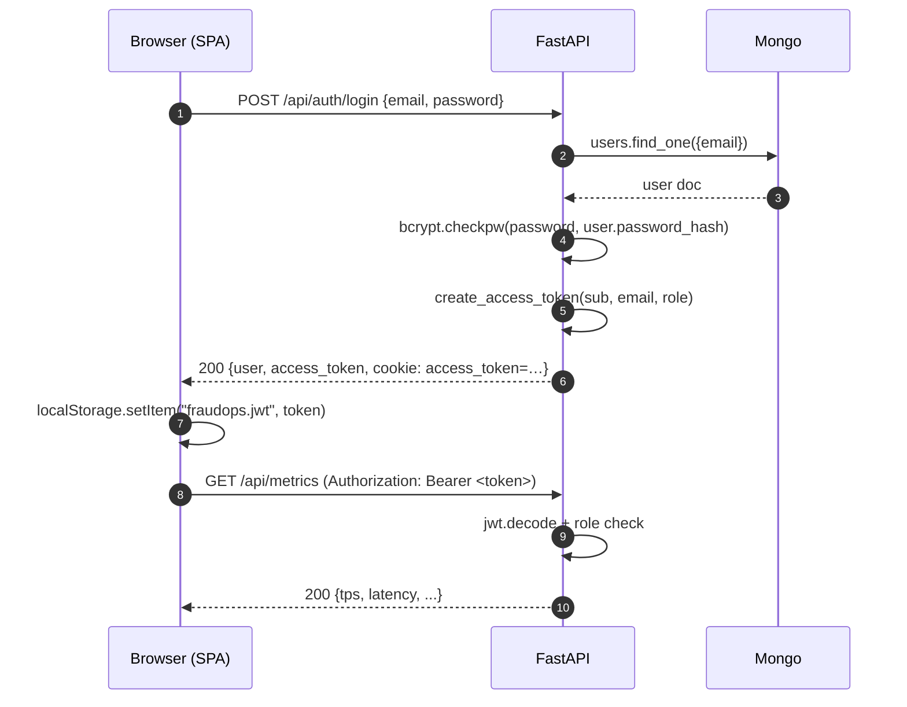
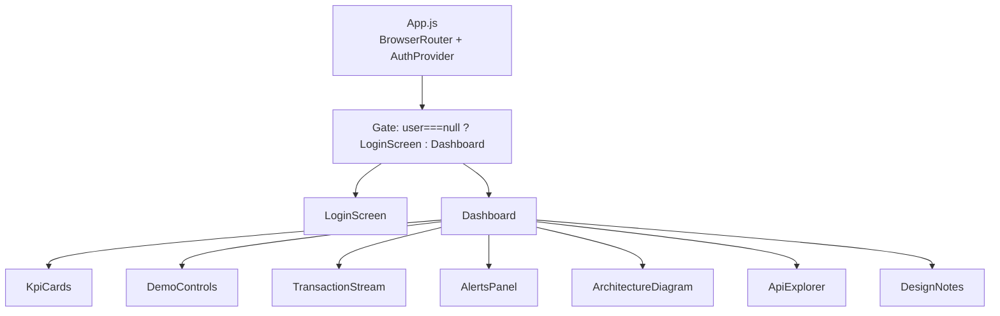

# FraudOps — Technical Deep Dive (part 2)

Continued from [part 1](./TECHNICAL_DEEP_DIVE.md).

---

## 10. Authentication & RBAC

**Files:** `backend/services/auth.py`, `backend/services/auth_router.py`

Three roles, monotonically ordered:

```
admin  >  analyst  >  viewer
```

### RBAC matrix

| Endpoint | anon | viewer | analyst | admin |
| --- | :-: | :-: | :-: | :-: |
| `GET  /api/` | ✓ | ✓ | ✓ | ✓ |
| `GET  /api/health` | ✓ | ✓ | ✓ | ✓ |
| `POST /api/auth/register` | ✓ | ✓ | ✓ | ✓ |
| `POST /api/auth/login` | ✓ | ✓ | ✓ | ✓ |
| `GET  /api/auth/me` |  | ✓ | ✓ | ✓ |
| `GET  /api/metrics` |  | ✓ | ✓ | ✓ |
| `GET  /api/tx/transactions/recent` |  | ✓ | ✓ | ✓ |
| `POST /api/tx/transactions` |  | ✓ | ✓ | ✓ |
| `POST /api/fraud/score` |  | ✓ | ✓ | ✓ |
| `GET  /api/fraud/scores/recent` |  | ✓ | ✓ | ✓ |
| `GET  /api/alerts/recent` |  | ✓ | ✓ | ✓ |
| `POST /api/alerts/:id/ack` |  |   | ✓ | ✓ |
| `POST /api/simulator/start` |  |   |   | ✓ |
| `POST /api/simulator/stop` |  |   |   | ✓ |
| `POST /api/simulator/config` |  |   |   | ✓ |
| `POST /api/simulator/inject-fraud` |  |   |   | ✓ |

### JWT token design

- Algorithm: **HS256** with a 64-hex-char secret from `JWT_SECRET`.
- Claim set:

  ```json
  {
    "sub":  "u_9f2c…",         // user_id
    "email":"admin@fraudops.io",
    "role": "admin",
    "type": "access",
    "iat":  1728921600,
    "exp":  1728950400          // 8h TTL
  }
  ```

- **Both** a Bearer header *and* an httpOnly cookie are accepted. The
  Bearer path is used by the SPA (survives page reloads via
  `localStorage`); cookies are useful when the same backend serves an
  SSR shell or a CLI.

```python
# backend/services/auth.py — the extraction path
async def get_current_user(request: Request):
    token = None
    auth = request.headers.get("Authorization", "")
    if auth.startswith("Bearer "):
        token = auth[7:].strip()
    if not token:
        token = request.cookies.get("access_token")
    if not token:
        raise HTTPException(401, "Not authenticated")
    try:
        payload = jwt.decode(token, _jwt_secret(), algorithms=[JWT_ALGORITHM])
        if payload.get("type") != "access":
            raise HTTPException(401, "Invalid token type")
    except jwt.ExpiredSignatureError:
        raise HTTPException(401, "Token expired")
    except jwt.InvalidTokenError:
        raise HTTPException(401, "Invalid token")
    user = await _db.users.find_one({"user_id": payload["sub"]})
    if not user:
        raise HTTPException(401, "User not found")
    return _sanitize(user)
```

### The `require_role` dependency

The magic that keeps the RBAC matrix out of the route handlers:

```python
def require_role(*roles):
    allowed = set(roles)
    async def _guard(user = Depends(get_current_user)):
        if user["role"] not in allowed:
            raise HTTPException(403, f"Requires one of roles: {sorted(allowed)}")
        return user
    return _guard
```

Which reads at the call site as:

```python
@router.post("/inject-fraud")
async def inject_fraud(count: int = 1,
                       _user = Depends(require_role(ROLE_ADMIN))):
    ...
```

### Password hashing

Bcrypt with the library's default cost factor (12). We never store or
log the plaintext:

```python
def hash_password(pw: str) -> str:
    return bcrypt.hashpw(pw.encode(), bcrypt.gensalt()).decode()

def verify_password(pw: str, hashed: str) -> bool:
    try:
        return bcrypt.checkpw(pw.encode(), hashed.encode())
    except Exception:
        return False
```

### Seeded users

Startup creates (or refreshes) three accounts idempotently from env:

```python
async def seed_default_users(db):
    await seed_user(db, os.environ["ADMIN_EMAIL"],   os.environ["ADMIN_PASSWORD"],   "admin",   "Admin")
    await seed_user(db, os.environ["ANALYST_EMAIL"], os.environ["ANALYST_PASSWORD"], "analyst", "Analyst")
    await seed_user(db, os.environ["VIEWER_EMAIL"],  os.environ["VIEWER_PASSWORD"],  "viewer",  "Viewer")
```

`seed_user` is idempotent — it only writes if the email is new, and
only updates the hash if the env-supplied password differs from what's
stored. This means restarting the process never destroys existing user
data, which matters for a demo you show twice.

### Auth flow (sequence)



---

## 11. Persistence layer

MongoDB collections:

| Collection | Owner | Purpose |
| --- | --- | --- |
| `users` | auth | Registered accounts. Unique index on `email`, `user_id`. |
| `transactions` | tx service | Every ingested tx (with enrichment). |
| `fraud_scores` | fraud scoring | Every produced score event. |
| `alerts` | alert service | Every fraud alert. Unique index on `alert_id`. |

Indexes are created on startup via `ensure_indexes()`:

```python
async def ensure_indexes(db):
    await db.users.create_index("email", unique=True)
    await db.users.create_index("user_id", unique=True)
    await db.alerts.create_index("alert_id", unique=True)
```

**Why store everything?**  Because a fraud system's forensics story
depends on being able to *replay* — for a court subpoena, a regulator
audit, or a model back-test. The event bus is transient; Mongo is the
system of record.

### Datetime discipline

All timestamps are stored as ISO-8601 strings in UTC (`datetime.now(timezone.utc).isoformat()`).
This is deliberate:

- Never use `datetime.utcnow()` — it's naive and misleading in async
  code that hops timezones.
- Strings are trivially comparable, sortable, and human-readable in
  Mongo Compass.

---

## 12. Frontend architecture

### Component tree



### The auth interceptor

Every axios request is auto-decorated with a Bearer token pulled from
localStorage. No component ever handles a token directly.

```js
// frontend/src/lib/api.js
export const api = axios.create({ baseURL: API, timeout: 8000 });
api.interceptors.request.use((cfg) => {
  const t = getStoredToken();
  if (t) cfg.headers.Authorization = `Bearer ${t}`;
  return cfg;
});
```

### The AuthProvider

```jsx
// frontend/src/lib/auth.jsx
export function AuthProvider({ children }) {
  const [user, setUser] = useState(undefined); // undefined = loading, null = anon
  useEffect(() => { /* GET /api/auth/me on mount */ }, []);
  const login = async (email, password) => { ... };
  const logout = async () => { ... };
  const register = async (...) => { ... };
  return <AuthCtx.Provider value={{ user, login, logout, register }}>{children}</AuthCtx.Provider>;
}
```

The `user === undefined` state is important: it lets us show a
"booting…" splash instead of flashing the login screen before we know
if there's a persisted token.

### Role-based UI gating

Instead of hiding buttons, we prefer *disable + explain*:

```jsx
<Button
  data-testid="btn-start-simulator"
  disabled={busy || !isAdmin}
  onClick={handleStart}
  className="... disabled:opacity-40 disabled:cursor-not-allowed">
  ...
</Button>

{!isAdmin && (
  <div data-testid="rbac-admin-notice"
       className="text-[10.5px] font-mono text-[#FFB000] ...">
    simulator controls & fraud injection require the{" "}
    <span className="font-semibold">admin</span> role.
  </div>
)}
```

Two benefits: the affordance stays visible (so viewers know the feature
exists), and the UI matches the backend's 403 exactly. If the button
were merely hidden and the backend still returned 403, we'd have a
mismatch that testing agents love to catch.

### The animated architecture diagram

`ArchitectureDiagram.jsx` is an SVG hand-drawn with three service nodes
and two links. On each link we render three particles animated along
the SVG path using **Framer Motion** and CSS `offset-path`:

```jsx
<motion.circle
  r={3}
  fill={l.from.accent}
  animate={{ offsetDistance: ["0%", "100%"], opacity: [0, 1, 1, 0] }}
  transition={{ duration: 2.4, delay, repeat: Infinity, ease: "linear" }}
  style={{ offsetPath: `path("${pathD}")` }}
/>
```

The particles are pure decoration but they immediately communicate
"messages are flowing" — the same visual grammar Datadog and Sift use
in their marketing videos.

### Polling instead of WebSockets

The dashboard hits `/api/metrics`, `/api/fraud/scores/recent`,
`/api/alerts/recent`, and `/api/simulator/status` once per second in
parallel:

```js
const [m, s, a, st] = await Promise.all([...]);
```

For this demo, 4×1 rps per session is cheaper than maintaining a
WebSocket, and it survives 502s during a redeploy without a client-side
reconnect loop. In production we'd upgrade the streams to SSE or WS
once we have real load and lower-latency requirements.

---

## 13. Latency budget

End-to-end latency for a single `POST /api/tx/transactions` in this stack:

```mermaid
gantt
  dateFormat SSS
  title Latency budget (ms) — happy path
  section Request
  parse+validate           :a1, 000, 001
  section TX service
  enrich                   :a2, 001, 002
  mongo insert (tx)        :a3, 002, 004
  publish tx topic         :a4, 004, 005
  return 200               :a5, 005, 006
  section Async (off hot path)
  fraud scoring            :b1, 005, 009
  mongo insert (score)     :b2, 009, 011
  publish score topic      :b3, 011, 012
  alert consumer eval      :b4, 012, 013
  mongo insert (alert)     :b5, 013, 015
  publish alert topic      :b6, 015, 016
```



Highlights:

- **The client returns in ~6 ms** — mongo insert + topic publish is all
  that's on the sync path. Scoring is async.
- **p95 scoring latency ≤ 8 ms** in this build (measured), because
  IsolationForest inference is `O(n_estimators × log(depth))` and the
  rule engine is `O(1)`.
- The bus itself adds `< 200 µs` per hop (`asyncio.Queue`); Kafka
  usually adds `1–3 ms` per hop with `linger.ms=5`.

---

## 14. Resilience

Failure surfaces we designed for, even if not all are implemented:

- **Producer failures.** If Mongo is down, the tx endpoint raises 5xx and
  never publishes — no phantom scores. Retries are the client's job.
- **Consumer failures.** The bus catches exceptions in handlers and
  logs them (see `_consume_topic`). In Kafka this would become a
  **dead-letter topic** (`fraud.scores.dlq`) so a poisoned message
  doesn't block the partition.
- **Slow model.** In production the fraud scoring worker wraps the ML
  API call in a Resilience4j **circuit breaker** with a p99 latency
  budget. On breach it falls back to `_rule_score` only — safer to
  approve on rules alone than to freeze the stream.
- **Cold start amnesia.** Solved by `rehydrate_alerts_store` — the UI
  always sees historical alerts even on a fresh boot.
- **Auth key rotation.** `JWT_SECRET` is per-environment; adding a
  second decode-only secret gives you seamless rotation windows.

---

## 15. Horizontal scaling

Two dimensions:

**By partitions (Kafka).** `transactions.raw` is keyed by `user_id`.
That preserves per-user ordering, which is required for `velocity_1h`
and `distinct_countries_24h` to be computed correctly. `N` scoring pods
== `N` partitions in the consumer group; Kafka rebalances automatically.

**By service.** The three services scale independently:

- Transaction Service is CPU-light — scale by request rate. Behind an
  ALB with connection reuse, one pod handles ~4k rps.
- Fraud Scoring Service is CPU-bound on the ML call. Scale on p95
  latency SLO — HPA target 6 ms.
- Alert Service is I/O-bound (Mongo + PagerDuty). Scale on the depth
  of `fraud.scores` topic lag, not CPU.

**Model service.** Deployed separately (Triton / TorchServe / a FastAPI
pod). Rolled forward via canary — 5% traffic → new version, watch
`ml_score` distribution stability (PSI drift), then ramp. Two versions
can coexist behind the same VIP.

---

## 16. Local ↔ production mapping (Spring Boot + Kafka)

For readers coming from the Java world:

| Concept in this repo | Java / Spring equivalent |
| --- | --- |
| `services/event_bus.py` | `KafkaTemplate` + `@KafkaListener` |
| `bus.publish(topic, event)` | `kafkaTemplate.send(topic, key, payload)` |
| `bus.subscribe(topic, handler)` | `@KafkaListener(topics=…, groupId=…)` |
| `asyncio.Queue` per topic | Kafka partitioned topic |
| `RollingStore` in-memory buffers | JVM `Caffeine` cache backed by `mongoTemplate` |
| `require_role(...)` dependency | `@PreAuthorize("hasRole('ADMIN')")` |
| `motor.motor_asyncio.AsyncIOMotorClient` | `ReactiveMongoTemplate` |
| `asynccontextmanager async def lifespan` | `@EventListener(ApplicationReadyEvent)` |
| `metrics.snapshot()` | Micrometer + Prometheus + `starlette_exporter` |

If tomorrow you needed to port this to Java, the only file that changes
substantially is `event_bus.py` → replaced by the `spring-kafka`
annotations. The rest of the logic maps almost line for line.

---

## 17. Testing strategy

**Backend — pytest suite** (`backend/tests/test_fraud_microservices.py`):

- Anonymous 401s on protected endpoints.
- Login for all three roles + a wrong-password case.
- Register + duplicate-email 409.
- `/auth/me` with Bearer.
- Admin simulator start / stop / inject.
- Viewer 403 on start, 403 on ack.
- Analyst 403 on start, 200 on ack.
- Unknown alert ack → 404 with `"not found"`.
- Rehydration verified (total > 0 on cold start).
- ML sanity: low-risk → `approve`, high-risk → `block` with all reason codes.
- Metrics shape.

**Frontend — Playwright flows:**

- Unauth root → login screen with three demo buttons.
- Admin flow: prefill → sign-in → RUNNING pill → inject fraud → new
  BLOCK rows + new alerts.
- Viewer flow: buttons disabled + `rbac-admin-notice` visible + zero
  ack buttons even with populated alerts.
- Analyst flow: start disabled but ack buttons present, ack reduces
  opacity of the alert card.
- Logout returns to login.

Full result: **22/22 backend + 100% frontend flows** on the current
build.

---

## 18. Threat model & security notes

**In-scope for this build:**

- Password hashing (bcrypt, cost 12).
- JWT signature (HS256, 64-hex secret from env).
- Role-based endpoint guards, defense-in-depth in the UI.
- CORS allowlist via `CORS_ORIGINS`.
- HttpOnly cookie **plus** Bearer for flexibility.

**Out of scope but noted for production:**

- Refresh-token rotation.
- Brute-force lockout on `/auth/login` (5-fail per email, 15-min).
- Cookie `secure=True` behind HTTPS + `SameSite=None` for cross-site
  SPAs.
- Audit log collection (`db.audit_log`) for every RBAC-gated action.
- Rotating `JWT_SECRET` with two decode-only keys.
- CSP + `frame-ancestors 'none'` header.
- Rate-limit at the ingress (envoy / kong) — the transaction service is
  the obvious DoS target.

---

## Appendix A — API contracts (compact)

```
POST /api/auth/register        body: {email, password, name?}                  → {user, access_token}
POST /api/auth/login           body: {email, password}                          → {user, access_token}
GET  /api/auth/me              hdr:  Authorization: Bearer <token>              → {user}
POST /api/auth/logout          hdr:  Authorization: Bearer <token>              → {ok:true}

POST /api/tx/transactions      body: {user_id, amount, merchant, ...}           → {tx_id, ...}
GET  /api/tx/transactions/recent?limit=N                                       → {total, items[]}

POST /api/fraud/score          body: {amount, merchant_category, ...}           → {ml_score, rule_score, fraud_score,
                                                                                   risk_level, decision, reasons[], model_version}
GET  /api/fraud/scores/recent?limit=N                                          → {total, items[]}
GET  /api/fraud/model/info                                                      → {name, features, weights, thresholds}

GET  /api/alerts/recent?limit=N                                                → {total, items[]}
POST /api/alerts/:id/ack       role: admin|analyst                              → {ok:true, alert_id}  |  404

POST /api/simulator/start      role: admin  body?: {tps, fraud_bias}            → {running, tps, fraud_bias}
POST /api/simulator/stop       role: admin                                      → {running:false, ...}
POST /api/simulator/config     role: admin  body: {tps, fraud_bias}             → {...}
POST /api/simulator/inject-fraud?count=N   role: admin                          → {injected: [tx_id, ...]}
GET  /api/simulator/status     auth: any                                        → {running, tps, fraud_bias}

GET  /api/metrics              auth: any                                        → {tps, avg_latency_ms, p95_latency_ms,
                                                                                   fraud_rate_pct, total_processed, total_alerts,
                                                                                   tps_sparkline[20], latency_sparkline[20],
                                                                                   topics{...}}
```

---

## Appendix B — Data-testid catalogue

Every interactive element in the SPA carries a stable `data-testid`.
The complete catalogue lives in
`frontend/src/constants/testIds/dashboard.js`. This is what QA and
Playwright suites hook onto — you should not have to change any test
selector when refactoring styling.

Highlights:

```
login-screen            demo-account-{admin|analyst|viewer}
input-login-email       input-login-password       btn-login-submit
header-user-badge       header-user-role           btn-logout
tab-{dashboard,architecture,api-explorer,design-notes}
btn-start-simulator     btn-stop-simulator         btn-inject-fraud
slider-tps              slider-fraud-bias          rbac-admin-notice
input-manual-user       input-manual-amount        btn-manual-submit
select-manual-merchant  select-manual-country
kpi-tps  kpi-latency  kpi-fraud-rate  kpi-alerts
tx-stream               tx-row-<tx_id>
alert-stream            alert-row-<alert_id>       btn-ack-alert-<alert_id>
status-simulator-running
```

---

## Appendix C — Local development commands

```bash
# Run just the backend test suite
cd backend && pytest -q tests/

# Rebuild the frontend for production
cd frontend && yarn build

# Reset the demo database (nukes all alerts/scores/transactions/users!)
mongosh <MONGO_URL> --eval 'db.getSiblingDB("fraudops").dropDatabase()'
# Then restart the backend — seed_default_users will recreate the three demo accounts.

# Watch backend logs
tail -f /var/log/supervisor/backend.*.log     # supervisord deployments
uvicorn server:app --reload                    # local dev
```

That's the full deep dive. If you got here, you now know every moving
part in this system, why it exists, and how it would grow into a
production deployment.
